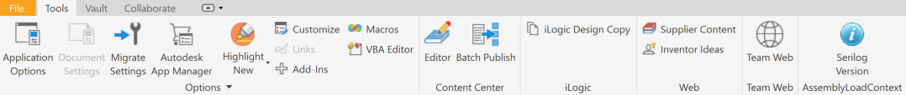
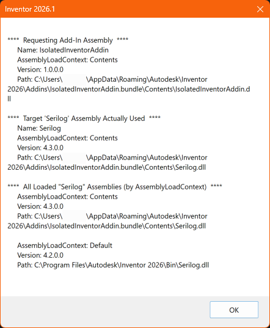
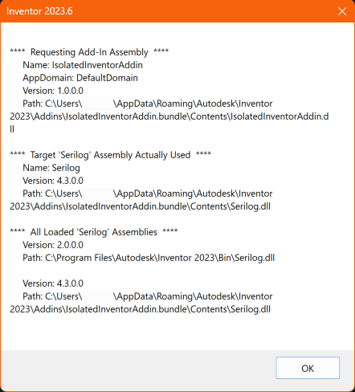

# Isolated Inventor Add-in Sample Using `Isolator.Fody` NuGet Package


[](https://dotnet.microsoft.com/en-us/download/dotnet/6.0)
[](https://opensource.org/licenses/MIT)

A minimal Autodesk Inventor add-in sample that demonstrates safe dependency isolation. Inventor ships with specific assembly versions. Referencing newer (or different) versions in an add-in often causes binding conflicts. This sample allows the use of NuGet package/assembly versions that differ from the ones bundled with Inventor using the 'Isolator.Fody' NuGet package to automatically isolate the add-in’s dependencies in a separate container using `AssemblyLoadContext`.





## Setup

### Run Locally

1. Clone this project or download it. It's recommended to install [GitHub Desktop](https://desktop.github.com/). To clone it via command line, use the following:
```
git clone https://github.com/tylerwarner33/autodesk-inventor-assembly-load-context-fody.git
```
2. Choose a configuration: `Debug-2026`, `Debug-2025`, `Debug-2024`, `Debug-2023` (or the corresponding `Release-*`) to work with that Inventor version.
3. Build the solution. The post-build step creates a bundle and copies it to (replace `<version>` and paste in file explorer):
   - `%AppData%\Autodesk\Inventor <version>\Addins\IsolatedInventorAddin.bundle\Contents\`
4. Run the solution (Inventor will launch automatically using the selected version, as configured in the project file).
5. Use the `Serilog Version` button to display the version/context of the loaded Serilog assembly.

### How It Works

- `AddinServer.cs`
  - __The main entry point for the add-in using the `OnActivate()` and `OnDeactivate()` methods. Custom add-in logic added here.__
- .NET 8 / Inventor 2025+:
  - `[Isolator]` attribute defines a dedicated `AssemblyLoadContext` so the add-in resolves managed and native dependencies from its own output folder first.
- .NET Framework 4.8 / Inventor 2023–2024:
  - The add-in runs in the default `AppDomain`. The sample still reports assembly identity to compare behavior across targets.
- The Interop assembly (`Autodesk.Inventor.Interop`) is referenced with `<Private>False</Private>` so it’s always loaded from Inventor, while the NuGet dependencies (ex. `Serilog`) are copied beside the add-in and loaded in isolation.
- The `Serilog Version` button (`SerilogPackageVersionButton`) shows the loaded Serilog version and the load context/app domain to verify isolation.
- The project uses MSBuild logic to pick the Inventor version and target framework based on the build configuration.

## Resources

- TylerWarner.dev Blog Post: [Isolate Autodesk Add-Ins With the 'Isolator.Fody' NuGet Package](https://tylerwarner.dev/assemblyloadcontext-for-autodesk-addins-with-isolatorfody)
- Isolator.Fody NuGet Package: [Isolator.Fody](https://www.nuget.org/packages/Isolator.Fody)
- Isolator.Fody GitHub Repo: [Isolator.Fody](https://github.com/ricaun-io/Isolator.Fody)
- Microsoft Learn: [System.Runtime.Loader.AssemblyLoadContext](https://learn.microsoft.com/en-us/dotnet/core/dependency-loading/understanding-assemblyloadcontext)
- Microsoft GitHub: [AssemblyLoadContext](https://github.com/dotnet/coreclr/blob/v2.1.0/Documentation/design-docs/assemblyloadcontext.md)

## License

This sample is licensed under the terms of the [MIT License](http://opensource.org/licenses/MIT).
Please see the [LICENSE](LICENSE) file for more details.
